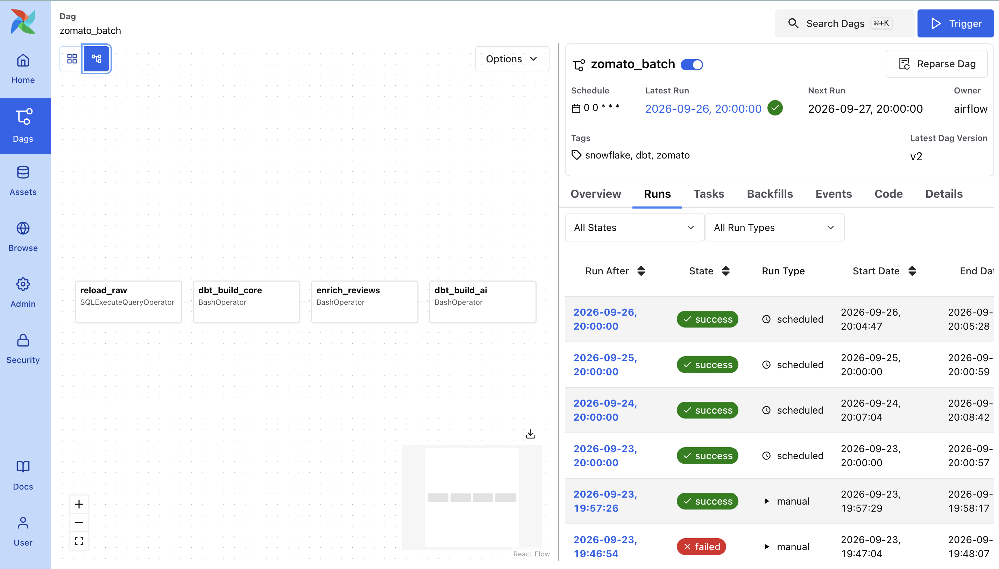
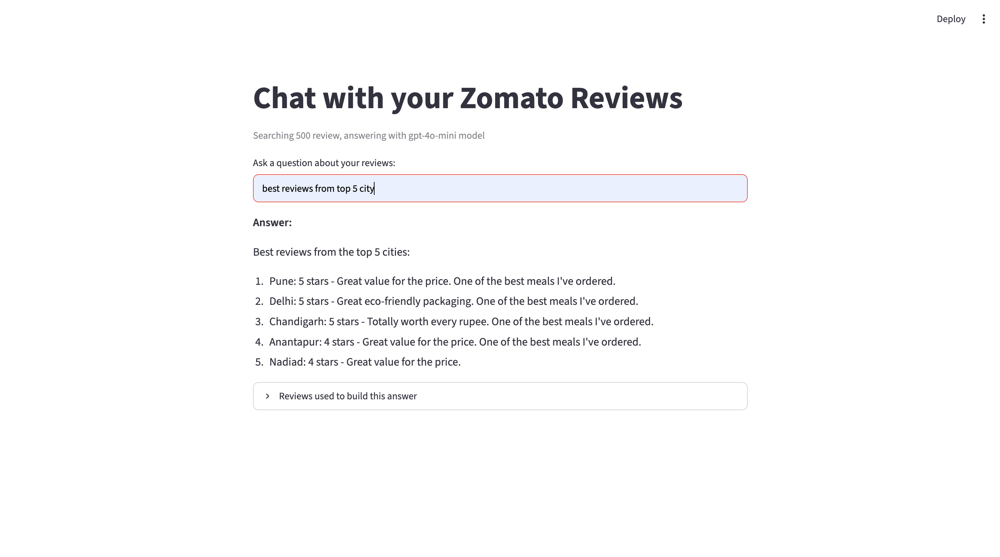
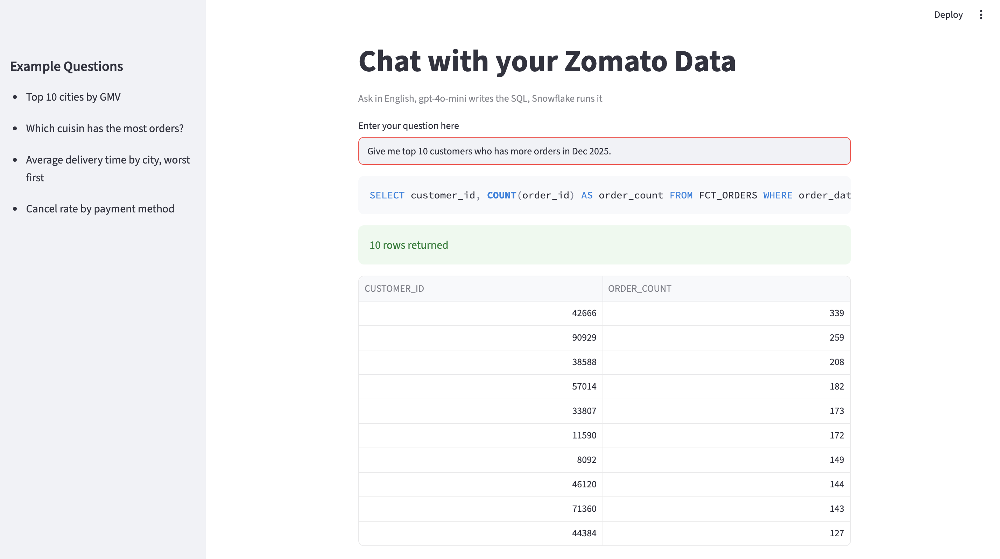

# 🍽️ Zomato AI Data Platform

**An end-to-end, production-style data engineering pipeline** — built on the Medallion Architecture — that ingests raw food-delivery data, transforms it into analytics-ready models, and layers three distinct GenAI capabilities (LLM enrichment, RAG, and Text-to-SQL) on top of the warehouse.

**Amazon S3 → Snowflake → dbt → Airflow → OpenAI → Streamlit**, fully orchestrated on a daily schedule and running entirely in Docker.

---

## 📐 Architecture


---

## 🗂️ What gets built

| Layer | Where | What |
|---|---|---|
| **Source** | `data/` (local, not committed) | 4 real dimension CSVs (restaurants, users, food, menu) + 3 generated fact files: **10M orders**, **~23M order items**, **300K free-text reviews** |
| **Lake** | Amazon S3 | One bucket, one folder per table under `raw/<table>/` |
| **Bronze** | Snowflake `ZOMATO.RAW` | `COPY INTO` from S3 via a **keyless** storage integration |
| **Silver** | Snowflake `ZOMATO.STAGING` | dbt views — clean, type, rename every source table |
| **Gold** | Snowflake `ZOMATO.MARTS` | Dimensions, **incremental** facts (MERGE strategy), business-ready marts |
| **AI** | Snowflake `ZOMATO.AI` | LLM-enriched reviews (sentiment/topic), consumed by RAG & text-to-SQL |
| **Orchestration** | Airflow (Docker) | One daily DAG: load → transform → enrich → AI mart |

---

## 🧱 Tech Stack

Python · Pandas · Numpy · Amazon S3 · Snowflake · dbt (`dbt-snowflake`) · Apache Airflow 3 (Docker Compose) · OpenAI (`gpt-4o-mini`, `text-embedding-3-small`) · Streamlit · RSA key-pair authentication

---

## 🔄 Orchestration (Airflow)

One daily DAG, `zomato_batch`, runs four dependent tasks as a single graph:

```
reload_raw  →  dbt_build_core  →  enrich_reviews  →  dbt_build_ai
(COPY from S3)   (dbt build+test)   (OpenAI enrichment)  (AI-tagged marts)
```

The order is deliberate, not arbitrary: `dbt_build_ai` builds models tagged `ai` that read from `ZOMATO.AI.REVIEW_ENRICHED` — so it can only run *after* `enrich_reviews` has actually populated that table with fresh data. Building it earlier would either fail outright or silently build on stale enrichment results.

Credentials never touch the code — Docker Compose injects `SNOWFLAKE_*` / `OPENAI_API_KEY` as environment variables, read via `.env` files that are `.gitignore`'d at every level of the repo.

---

## 🤖 AI Features

### 1. LLM Enrichment — `ai/enrich_reviews.py`
Turns unstructured review text into structured, queryable columns — *LLM as a transformation step*, not a chat feature.

- Fetches only unprocessed reviews (`WHERE review_id NOT IN (...)`) — idempotent, safe to re-run daily without reprocessing or re-billing for the same review
- `gpt-4o-mini` with `temperature=0` and forced JSON output extracts `sentiment_label`, `sentiment_score`, a `topic` constrained to a fixed taxonomy, and a short `key_issue`
- Batch-written to `ZOMATO.AI.REVIEW_ENRICHED` via `executemany`; one failed review never blocks the rest of the batch

### 2. RAG — "Chat with your Reviews" — `ai/rag_chat.py`
Semantic search over raw review text, with grounded, source-cited answers.

- 500 sampled reviews embedded via `text-embedding-3-small`, cached to Parquet so embeddings are computed once, not on every app restart
- The question is embedded the same way, ranked against every review by **cosine similarity**, top-5 matches retrieved
- Only those top-5 reviews are passed to the LLM, with an explicit *"answer ONLY using these reviews"* instruction — every answer shows exactly which reviews it was built from

### 3. Text-to-SQL — "Chat with your Data" — `ai/text_to_sql.py`
Natural-language access to the Gold-layer marts, safely.

- The LLM only ever sees table/column names (a hand-written schema description) — never actual data rows
- **Two independent safety layers**, not just prompt instructions: the system prompt constrains it to a single `SELECT`, and a code-level `is_safe()` check independently rejects any query that doesn't start with `SELECT`/`WITH` or that contains `DROP`, `DELETE`, `TRUNCATE`, `ALTER`, `INSERT`, `GRANT`, etc. — never trust an LLM's output to be safe just because you asked nicely
- Generated SQL is shown on screen before execution; results render as a table, with an automatic bar chart when the result is a simple category/value pair

---

## 🛠️ Challenges & Solutions

Real problems hit while building this, and how they were resolved:

| Problem | Root Cause | Fix |
|---|---|---|
| `dbt debug` failed with an MFA authentication error | Snowflake blocks password-based login for programmatic/service connections when MFA is enabled on the account | Switched dbt, Airflow, and every Python script to **RSA key-pair authentication** — no passwords stored or transmitted anywhere |
| `dbt build` failed inside the Airflow container with `profiles.yml not found` | The container's filesystem is isolated from the host Mac — `~/.dbt/profiles.yml` on the host isn't visible inside Docker | Created a **second `profiles.yml`** inside the dbt project itself, pointing to the private key's *container* path (`/opt/airflow/keys/...`), separate from the host-machine version used for local development |
| Airflow's `apiserver` failed to bind to port 8080 | A separate, unrelated Airflow project from earlier learning was still running in the background, holding the port | Identified the conflicting container with `docker ps` / `lsof -i :8080` and stopped it explicitly, rather than guessing |
| `docker-compose up` failed with a Postgres DNS resolution error (`could not translate host name "postgres"`) | A stale/corrupted Docker network from a previous `up` attempt | `docker-compose down` followed by a clean `docker-compose up` rebuilt the network correctly |
| `streamlit run` failed with `No module named 'streamlit.cli'` | An outdated Streamlit install under Anaconda was shadowing the correct `pip3`-installed version in the shell PATH | Always launch via `python3 -m streamlit run ...`, which explicitly uses the correct Python environment's install |

---

## 📁 Repository Structure

```
├── docs/
│   └── architecture.png
├── airflow/                  # Airflow 3 on Docker
│   ├── Dockerfile
│   ├── docker-compose.yml
│   ├── .env                  # SNOWFLAKE_* / OPENAI_API_KEY (gitignored)
│   └── dags/zomato_batch.py  # the pipeline DAG (4 tasks)
├── zomato/                   # dbt project
│   ├── models/staging/       # 7 staging views (Silver) + sources + tests
│   ├── models/marts/         # dims, incremental facts, business marts (Gold)
│   ├── macros/               # custom schema-naming macro
│   └── profiles.yml          # container-path version (gitignored)
├── ai/                       # GenAI layer
│   ├── enrich_reviews.py
│   ├── rag_chat.py
│   ├── text_to_sql.py
│   └── .env                  # gitignored
├── snowflake/                # one-time infra setup SQL, run in Snowsight in order
│   ├── 01_setup.sql          # warehouse, database, schemas, role
│   ├── 02_storage_integration.sql
│   ├── 03_stage_and_formats.sql
│   ├── 04_raw_table.sql
│   └── 05_copy_into.sql
└── README.md
```

> Raw data, generated embeddings caches, dbt `target/`, logs, and all secrets (`.env`, `*.p8`, `profiles.yml`) are intentionally excluded from version control.

---

## 🔐 Security Practices

- RSA key-pair authentication throughout — no plaintext passwords, MFA-compatible for all automated/service connections
- Dedicated least-privilege Snowflake role (`DBT_ROLE`) for all tooling, separate from personal login
- Every secret verified excluded from git history (`git check-ignore`) before every push, not just assumed
- Parameterized SQL inserts (`%s` placeholders) — never string-concatenated queries
- Defense-in-depth guardrails on the only feature that lets an LLM's output execute automatically against real data

---

## 🚀 Running Locally

```bash
# 1. Snowflake objects — run snowflake/01 → 05 in Snowsight, in order

# 2. dbt
cd zomato
dbt debug && dbt build --exclude tag:ai

# 3. Airflow
cd ../airflow
cp .env.example .env   # fill in Snowflake + OpenAI credentials
docker compose build && docker compose up -d
# UI: http://localhost:8080 (admin/admin) → un-pause zomato_batch → Trigger

# 4. AI apps
cd ../ai
python3 -m streamlit run rag_chat.py      # chat with reviews
python3 -m streamlit run text_to_sql.py   # chat with the warehouse
```

---

## 📸 Screenshots

**Airflow — orchestrated pipeline**


**RAG — Chat with your Reviews**


**Text-to-SQL — Chat with your Data**


## 👤 Maneesha

Built end-to-end as a data engineering portfolio project — covering raw ingestion, medallion modeling, incremental transformation, containerized orchestration, and three architecturally distinct applied-GenAI patterns.